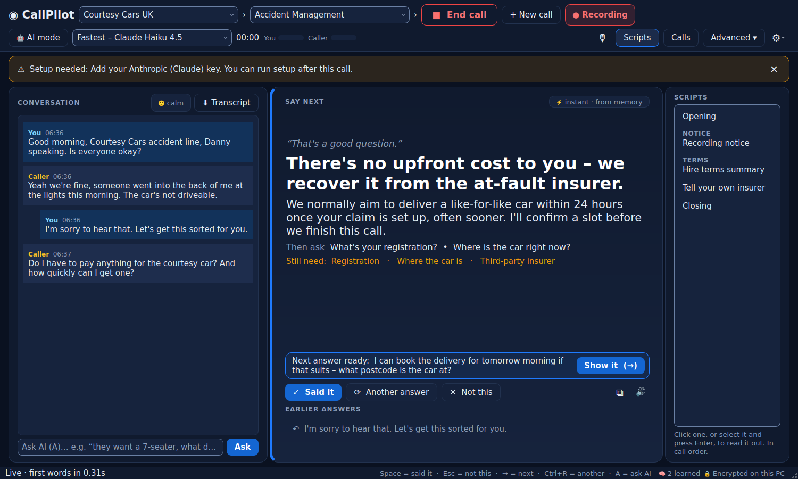
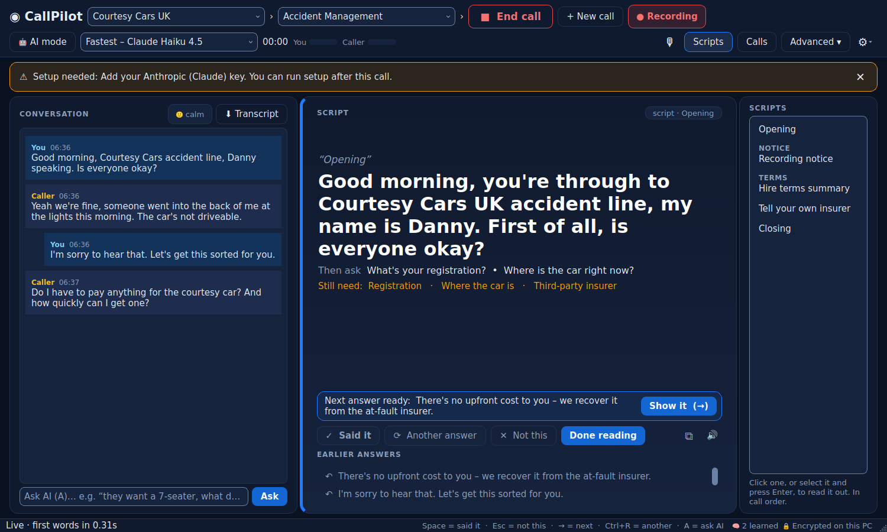
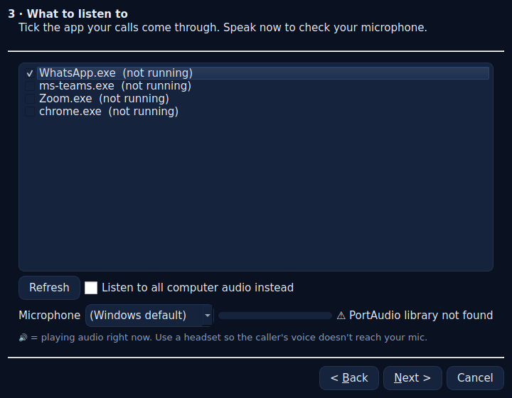
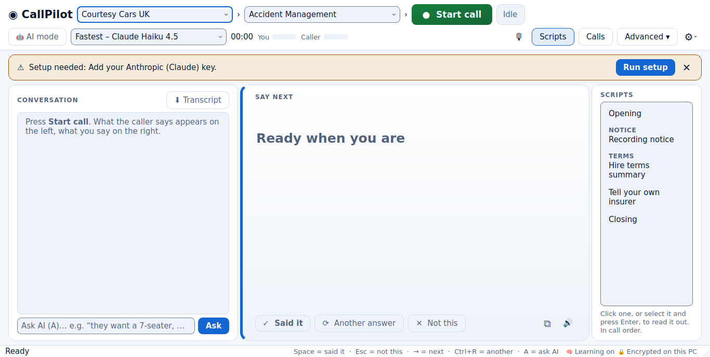
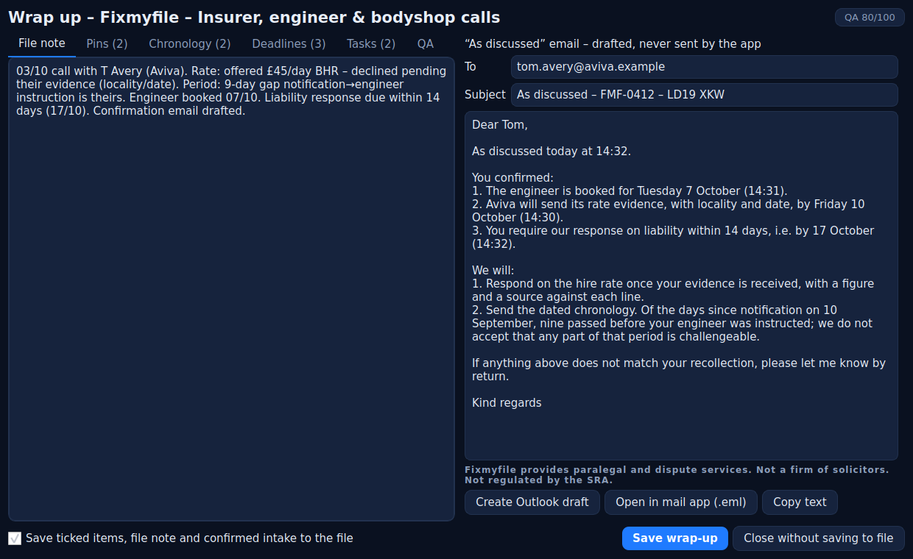
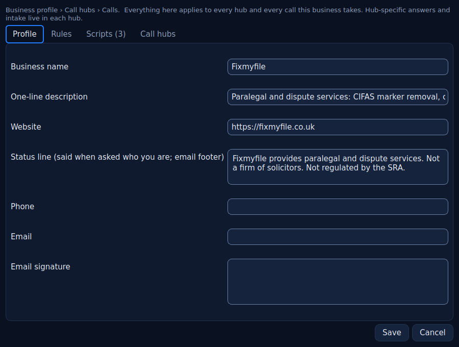
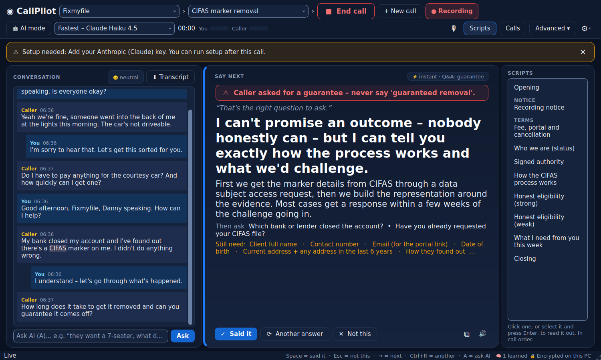
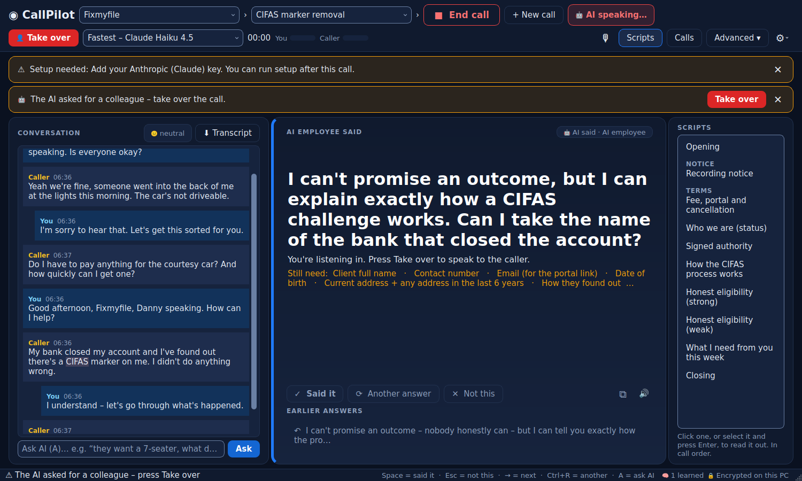
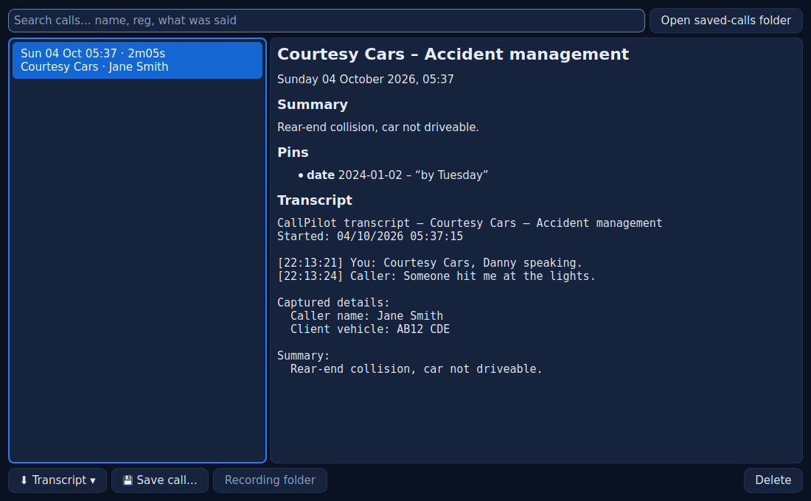
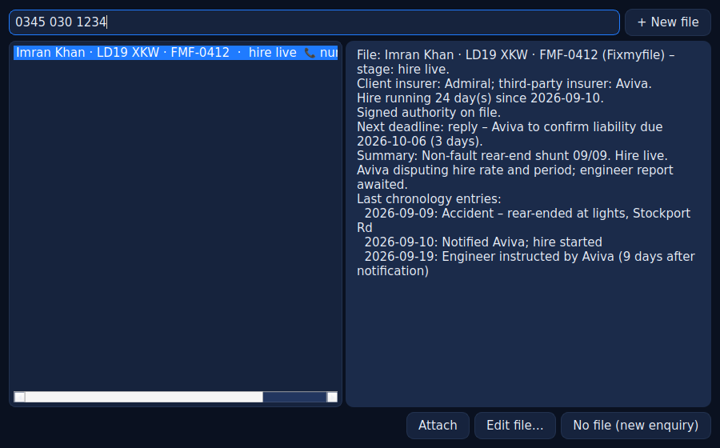

# CallPilot

CallPilot listens to the call (the other person through WhatsApp / Teams / Zoom / your softphone, and you through your mic), writes down what is said, and shows you **what to say next** and **what you still need to find out**. It remembers your past calls and trains itself after every one. Everything is organised **Business profile → Call hub → Call & transcript**: the business holds the rules and scripts for every call it takes, each hub is one call type with its own answers and intake, and every call is saved, downloadable and (if you choose) recorded. Switch on **AI mode** and a named member of the team takes the call in a realistic voice while you watch.



## The simple view (default)

Two panes and a scripts rail. Left: *they said · you said*. Middle: **Say next** – one big answer, written while the caller is still finishing. A red line above it if there is a risk, a blue "then ask" line under it and an amber **Still need:** line listing the intake details you have not captured yet. Right: the **scripts** for this business and hub, in call order.

- **Business › Hub** – pick the business (Courtesy Cars UK, Fixmyfile, or your own), then the call hub under it. The breadcrumb is the hierarchy: business rules apply to every hub, the hub adds the call-type specifics.
- **● Start call** – or let it start itself: when WhatsApp (or another call app) begins playing audio, a banner offers to listen. **+ New call** ends the current call (saving it) and opens a fresh one in one click.
- **It never changes what you are reading.** An answer only ever grows – new words are appended, the start stays put (enforced in the engine as well as the screen). If a better answer arrives while you are still reading, it waits in a blue **Next answer ready** bar: press **→** or *Show it* when you are done, or it comes through on its own after a few seconds.
- **Scripts** – click any script (opening, recording notice, terms, status line, closing) and it is pinned on top, full size, until you press **Done reading**; answers queue behind it. Reading the recording notice marks the call as notified.
- **Said it (Space)** / **Another answer (Ctrl+R)** / **Not this (Esc)** – and every one of those teaches it.
- **AI** dropdown – *Fastest* (Claude Haiku 4.5), *Balanced* (Claude Sonnet 5.5), *Smart* (Claude Opus 5.5), *Max* (Claude Fable 5.1 – slower, deepest), or *ChatGPT*.
- **🤖 AI mode** – an AI employee takes the call (below). **👤 Take over** hands it back.
- **🧠 in the status bar** – reads *Learning on* until it has learned something, then *n learned*; hover it for the answers, facts and lessons behind the number.
- **You / Caller** – the two level bars in the top bar; if *Caller* stays flat while they are talking, their audio is not being captured.
- **⬇ Transcript** – download this call's transcript as .txt or .docx. **Calls** – every call on this PC: read, search, download, save the whole call, play the recording.
- **Advanced ▾** – opens the full Call Desk cockpit underneath (file, intake form, pins, checklist, wrap-up tools). Settings → Interface switches the default view.
- **Earlier answers** – the last few suggestions sit under the current one; click to bring one back. ⧉ copies, 🔊 reads it aloud. A long answer scrolls inside the panel; on a small or scaled screen the scripts rail and *Earlier answers* tuck away to give the answer the room (**Scripts** brings the rail back).
- **⚙** – Business profile…, Edit / train this hub…, Rehearse with the AI…, Settings…, Run setup again…, Save last call to computer…, Call history…, Floating overlay.
- **First run** – a four-step setup (AI key with a connection test → speech engine → which app to listen to, with a live microphone meter → your name). An amber banner tells you if anything is still missing; a second banner appears when a newer build is available to download.





### Easy on the eyes, easy by keyboard

- **Fits a laptop.** The whole window fits a 1366 x 768 screen and Windows scaling up to 150 %; on a narrow screen the scripts rail and button labels shorten instead of anything falling off the edge. Opening **Advanced** never squeezes the answer below two readable lines – the file and intake area scrolls inside the drawer instead.
- **Readable in both themes.** Text, buttons, badges, warnings and placeholders meet WCAG AA contrast in dark and light. Status is always written in words as well as colour (*Recording · notice given*, *Idle*, *AI listening*).
- **Keyboard all the way.** Tab reaches every control with a visible focus ring, and Enter or Space presses the one you Tabbed to. Otherwise Space is *Said it* and Esc is *Not this*, whatever you last clicked. Select a script and press Enter to read it.
- **Change it live.** Settings → Interface → *Theme* and *Font size* apply the moment you press Save, mid-call included. Global hotkeys are shown and typed the Windows way (*Ctrl+Shift+L*).



## Memory and self-training

After every call, in the background, CallPilot:

1. **Remembers the answers that worked** – every suggestion you marked *Said it*, and every caller question you answered in your own words, becomes a remembered answer. Next time a caller asks something similar it is on screen instantly, in your words, before the AI has even been asked.
2. **Forgets what you reject** – *Not this* lowers that answer's score; three rejections and it is gone.
3. **Distils the call with the stronger model** – new Q&A pairs, durable facts about the caller or company ("Aviva handler wants rate evidence by email"), and lessons about how you like to handle things ("lead with reassurance, keep it to two sentences").
4. **Uses all of it live** – the memory is cached into the prompt at call start (preferences, facts about this caller, answers that worked), and the three most relevant memories are added to every card request.

Everything it learns is encrypted on your PC and reviewable in **Settings → Memory**: delete anything that is wrong, teach an answer by hand, or forget everything. Nothing is uploaded anywhere except, as part of the prompt, to the AI provider you chose.

---

## Advanced view: Call Desk

The cockpit from the Call Desk spec: one screen that answers every Courtesy Cars and Fixmyfile call. It pops the file, transcribes both sides live, has AI suggest the next question, the right answer and the risk to watch, fills the intake form and the chronology as the call runs, and drafts the "as discussed" email before you hang up.

It is open, recorded with notice, and built so every transcript and AI card could be read out in court without embarrassment. There is no invisibility mode and no send button.


<p align="center">
  <a href="https://github.com/dannykaleem07-commits/logo/releases/download/callpilot-latest/CallPilot-Setup.exe">
    
  </a>
  &nbsp;
  <a href="https://github.com/dannykaleem07-commits/logo/releases/download/callpilot-latest/CallPilot.exe">
    
  </a>
</p>
<p align="center"><a href="https://github.com/dannykaleem07-commits/logo/releases/tag/callpilot-latest">All files &amp; checksums</a> · Windows 10 2004+ / 11 · SmartScreen: <i>More info → Run anyway</i></p>


## The cockpit

| Zone | What sits there |
|---|---|
| **Top bar** | Hub, call type, matched file, recording dot (**amber until the notice is given, red after**), timer, caller language, live model, toggles for Auto answer / Whisper / Translate, mute |
| **Left: File** | Client, reg, stage, hire day count, next deadline (**amber under 7 days, red under 48 hours**), signed-authority status, last 5 chronology events. Read-only during the call |
| **Centre: Transcript** | Speaker-labelled lines, newest at the bottom, auto-scroll that pauses when you scroll up. Dates, deadlines, money, registrations and references appear as **chips inside the line**; pinned lines get a coloured left edge |
| **Right: AI** | Max three cards (**Ask next · Say this · Watch out**), the intake progress ring with the missing fields, and the ask-AI box |
| **Bottom bar** | End call, Pin (P), Create task (T), Notice given, Pause for card details, Book car, Wrap up |

Watch out is the only red element on screen. Every card shows its source. Cards fade after use.

**Hotkeys inside the window:** `Space` mark the top card used · `Esc` dismiss it · `P` pin the last line · `T` create a task · `A` ask AI · `W` whisper on/off · `Ctrl+R` regenerate.
**Global hotkeys (work while WhatsApp has focus):** `Ctrl+Shift+L` start/end call · `Ctrl+Shift+P` pin · `Ctrl+Shift+C` copy top card · `Ctrl+Shift+O` overlay · `Ctrl+Shift+Space` regenerate.

## What happens when the caller stops talking

| Time | What you see |
|---|---|
| **< 1 ms** | Dates, deadlines ("you've got 14 days"), figures, registrations, admissions and allegations are extracted on your PC. They become chips in the line and **pins** in the chronology, each with the exact words, the timestamp and a 10-second audio clip |
| **< 1 ms** | **Rule cards** from the trigger table (no model involved): injury → Watch out; fraud language → Watch out + "put it in writing" Ask; insurer offers a figure → Say this counter; distress / complaint / police → Watch out; new client agreeing to start → 14-day cancellation Ask; no signed authority with a third party on the line → red Watch out pinned to the top |
| **< 5 ms** | A **⚡ approved answer** if the line matches the hub's Q&A bank, shown as the Say card with its source |
| **~0.5 s** | The fast model's **Say this** streams in word by word, then **Ask next**, **Watch out** and the **source** it relied on |
| **end** | Every card is logged with shown / used / dismissed / ignored. Review the dismissed ones weekly to tune the playbooks |

**Speculative drafting** starts the model while the caller is still finishing their sentence. If their last words don't change the meaning, the draft is used as it is, which saves a full round-trip.

## What fires a card (built into the code, not just the prompt)

| Trigger heard | Card |
|---|---|
| Caller asks a question | Say this, drawn from the playbook |
| Intake field still missing | Ask next |
| Date, deadline or commitment | Pin + deadline, and a "just to confirm for the record" Say this on third-party calls |
| Injury, whiplash, hospital, GP | Watch out: regulated area, follow the referral process, do not advise |
| Fraud, staged, "not consistent", "we're investigating" | Watch out + Ask: put the allegation in writing with the evidence relied on |
| Insurer offers a figure or rate | Say this: noted, not accepted, which lines are disputed and on what basis |
| Account differs from the file or an earlier line | Watch out with both values |
| No signed authority and a third party on the line | Watch out pinned to the top |
| New client agreeing to start work | Ask: confirm in writing within the 14-day cancellation period |
| Distress, complaint, police | Watch out: offer a named call-back, log as a complaint if it is one |

A **banned-phrase filter** runs on every card and every draft before display. The Fixmyfile hub bans "solicitor", "lawyer", "legal advice", "we act for", "our client", "guaranteed", "no win no fee".

## Wrap up

When you end the call the screen flips to **Wrap up** (one call to the stronger model):



- **File note** in the house voice, **pins** confirmed, **chronology** lines, **deadlines** found, **tasks** with owners, and the **"as discussed" email** side by side.
- Every item points back to the transcript line it came from.
- **Post-call QA**: scored against the checklist (notice given, authority confirmed, intake complete, follow-up drafted, no banned phrases) with a coaching tip.
- **One button saves the lot to the file.** Nothing saves silently. Intake values the AI heard stay greyed and unconfirmed until you tick them.
- The email goes to **Outlook → Drafts** (desktop Outlook via COM), or opens as an unsent `.eml` in your mail app, or copies to the clipboard. **The app has no send capability**; the final click is yours. The hub's status line is appended as the footer.

## Business profiles → Call hubs → Calls

**Business profile** (⚙ → *Business profile…*): the name, website, legal **status line** (what you say when asked who you are; also the email footer), **house rules the AI must follow on every call**, **banned phrases** (alerted if you say them, filtered from AI output), the **scripts** you read out, the email signature, and the list of call hubs under the business. Set a rule once here and every hub of that business follows it.

**Call hub**: one call type's brain under a business – persona, tone, opening / closing / consent scripts, extra rules, Q&A bank, knowledge base (paste text or import PDF / Word / TXT / CSV), intake fields (what the app chases in the *Still need* line), escalation keywords, disclosures and **per-call-type instructions**. ⚙ → *Edit / train this hub…* or the *Call hubs* tab of the business profile.

**Call & transcript**: every call is saved encrypted on this PC and, by default, written to *Documents\CallPilot\Calls\<date hub – caller>* as transcript.txt / .srt / .docx, call.json, pins.csv, the as-discussed email draft and recording.wav.

Two businesses and three hubs ship pre-loaded:

- **Courtesy Cars UK → Accident Management**: FNOL, replacement vehicles, recovery, repairs, write-offs, injury referral, police reporting. Call types: new accident, insurer handler, engineer, bodyshop, client chase.
- **Fixmyfile → CIFAS marker removal** – the CIFAS specialist hub, built from fixmyfile.co.uk's service pages and the Fixmyfile playbook: what a CIFAS marker is and the categories, how to find out (DSAR to CIFAS), the three-step process (file, evidence, representation), honest eligibility (strong vs weak cases), bank account closures and mortgage knock-on effects, timescales, what the client must send this week, the Financial Ombudsman route, GDPR and the data controller, and the status wording. Intake: name, contact, email for the portal link, date of birth, addresses, how they found out, lender, marker category and date, what the lender alleges, the client's account of events, evidence held, other lenders affected, urgency, signed authority, fee explained. Rules: never say "guaranteed removal", never quote a success rate, never give regulated advice, never imply solicitor status. Call types: new enquiry, client chase, CIFAS member / lender, CIFAS itself, credit reference agency.
- **Fixmyfile → Insurer, engineer & bodyshop calls**: the handler-call coach. Make them particularise any fraud allegation, ask who bears the burden, push back on the first number with a figure and a reason, log every day of insurer delay, confirm every commitment in writing today. Call types: handler, engineer, bodyshop, council, client chase.





**✨ Generate Q&A from knowledge** turns your documents into an answer bank. Review every answer before saving. The built-in hubs are templates: fees, timescales and guarantees must be checked against your live terms before use.

## AI mode: an AI employee takes the call

Press **🤖 AI mode** on a live call and a named member of the team (Settings → *AI mode* → employee name, voice) answers the caller in a realistic voice, using the business rules, the hub's answers and what it has learned from you. Every line it says is in the transcript as *You* and shown in the Say panel, so you can follow the call and step in. Press **👤 Take over** at any moment.

- **Audio**: it speaks into the device you choose and refuses to start if that device is not connected, so it can never talk into the room by mistake. On a real call that is a virtual cable (install the free VB-Audio Virtual Cable; CallPilot speaks into *CABLE Input*, and WhatsApp / Teams uses *CABLE Output* as its microphone). The caller still comes in through the normal app capture.
- **Barge-in**: if the caller talks over it, it stops and listens (on real calls; in rehearsal the microphone would hear its own voice, so it finishes its sentence and ignores the echo).
- **Hand-off**: on a request for a person, a complaint, injury, police, court, fraud, distress or anything outside the playbook it says the hand-off line ("Let me pass you to a colleague…"), goes quiet, and a banner asks you to take over.
- **What it says about itself**: it does not announce that it is automated. If a caller asks directly whether they are talking to a real person it answers truthfully in one sentence and offers a colleague. You are responsible for whether using an automated agent on your calls is permitted for your business and in your jurisdiction.
- **Train it**: ⚙ → **Rehearse with the AI…** starts a call with your microphone as the caller and your speakers as its voice. Talk to it as a customer would; mark its answers *Said it* / *Not this*, add rules in the business profile and answers in the hub, and it uses them on the next call. Rehearsals are saved like any other call.



## Saving, downloading and recording calls

- **Recording** (Settings → *Recording & email*): stereo WAV, caller left / you right, encrypted on disk, with the recording notice time stamped in the transcript. Pause with one click when card details are read out.
- **Auto-save** (Settings → *AI mode* → *Save every call to this PC*): after every call the transcript (.txt, .srt, .docx), call.json, pins.csv, the as-discussed email draft and the decrypted recording.wav are written to *Documents\CallPilot\Calls* (or the folder you choose).
- **⬇ Transcript** on the call screen downloads the current or last call's transcript; **Calls** lists every call with search, *⬇ Transcript ▾* (.txt or .docx), *Save call…*, *Recording folder* and *Delete*; the wrap-up dialog has **💾 Save call to computer…**.



## Files, pins, deadlines and search

- **Files** (left column) live in an encrypted local store: business, client, reg, reference, stage, hire start/end, signed authority, engagement, cancellation waiver, insurers, contacts with phone numbers, chronology, deadlines, tasks and the intake on file.
- **Attach a file** before the call by name, reg, reference, insurer or by pasting the caller's number (contacts are matched on number). Unknown caller = new-enquiry mode.
- The file summary is cached into the AI prompt at call start, so each card request only adds the last 90 seconds of transcript.
- **Deadline radar**: "you've got 14 days", "we'll respond within 21 days", "reply by Friday" become dated deadlines linked to the moment on the call. Hire days run from the file's hire start.
- **Search every call** (History): "Aviva hire rate Khan" returns the line, the time and the audio clip.



## Audio, speech and translation

- **Per-app capture.** Only the selected app's audio (WhatsApp, Teams, Zoom, a softphone, a browser) via Windows process loopback; or all computer audio. Your mic is a separate track, with an echo guard.
- **Recording.** One stereo WAV per call (caller left, you right), encrypted into the vault when the call ends. **Pause for card details** silences audio, transcript and AI until you resume (PCI). Pauses are logged.
- **Speech engines:** Deepgram Nova-3 streaming (~300 ms, follows language switches), OpenAI `gpt-4o-transcribe`, or offline faster-whisper. Partials are shown; only finals go to the AI; voice activity decides when a turn has ended.
- **Live translation**: subtitles in English under what the client says, and your reply in their language on the Say card to read back or text after.
- **Whisper audio.** The top card is read quietly into one ear of your headset (OpenAI TTS, left/right/both), so you can answer without looking at the screen. Only you hear it. Toggle per call with `W`.
- **Voice interpreter**: the 🔊 button speaks the translated reply through any output device (point it at a VB-Audio cable to send it into the call).

## AI

- **Model split**: a fast model for live cards and a stronger model for wrap-up, email and file notes. Defaults: Claude **Haiku 4.5** live, **Claude Sonnet 5.5** wrap-up (ChatGPT equivalents available). Swap per task in Settings; prompts are model-agnostic.
- **Prompt caching**: the hub and the file summary are cached blocks; each card request only adds the context and the last 90 seconds.
- Live cards use the tagged format `SAY / MORE / ASK / WATCH / SOURCE` so the Say card can appear while the rest is still being written. Wrap-up returns structured JSON with a segment id on every item.
- Card prompt rules: one sentence under 25 words, name the source, open questions only, never state facts not in the file, never promise an outcome, if injury is mentioned return a Watch card and stop.

## Security and compliance

| Area | How it works |
|---|---|
| Call history, recordings, files | **AES-256-GCM** at rest. Tampered files are rejected |
| Data key | Random 256-bit key protected by **Windows DPAPI**; optional master passphrase (scrypt) asked at every start |
| API keys | **Windows Credential Manager**. Never in settings files or logs |
| Payment data | Card numbers (Luhn-checked), CVV, sort codes and account numbers are stripped before anything reaches an AI provider; plus the Pause button |
| Personal data | Phone, email, NI number, DOB and postcode redacted from saved history and logs |
| Audit log | **Tamper-evident** HMAC-SHA256 chain; *Settings → Privacy → Verify* |
| Retention | Automatic deletion after N days (default 30), overwritten before unlink |
| Screen-share privacy | Windows hidden from screen sharing, screenshots and recordings |
| Recording notice | Top bar stays amber until the notice is detected in your speech or you press **Notice given**; `notice_given_at` is stored on the call |
| Email | Draft-only by construction; there is no send path in the code |
| Telemetry | None |

> "Military grade": AES-256-GCM is the cipher in the NSA's CNSA suite, but CallPilot has **not** been through FIPS 140-3 or Common Criteria certification. A DPIA, signed processor terms (telephony, speech, AI) and data-protection sign-off are still your pre-launch gates.

## What the EXE cannot do (needs the telephony backend in the spec)

These items from the Call Desk spec depend on calls running through your own phone numbers with a provider that forks both audio tracks (Twilio / Telnyx), a server and a database. The desktop app provides the local equivalent where one exists:

| Spec item | Desktop status |
|---|---|
| Caller-ID file pop from your numbers | **Manual**: paste the number or search; contacts match on number |
| Two clean audio tracks from SIP | Per-app capture + mic track; echo guard instead of true isolation |
| Supervisor board (every live call on one screen, listen in / take over) | Not possible from one desktop; needs the event bus |
| AI receptionist (out of hours) | Needs telephony; not built |
| Shared search across the whole team | Local history search per desk; export JSON to a shared store |
| Hosting in a UK region | N/A – data stays on the PC; providers are your choice |

Decisions still needed before that build: current phone setup, where files live today (the integration target), number of handlers and calls a day, Outlook or Gmail, client languages, whether an AI receptionist is wanted, FCA perimeter advice for injury-adjacent calls.

## Getting started

1. **Install**: click the download button at the top of this page (`CallPilot-Setup.exe`), or use the portable `CallPilot.exe`. The installer closes a running copy, keeps your settings and calls, offers *Start with Windows*, and the app shows a banner with a download link when a newer build is published. Every green build refreshes the [`callpilot-latest`](https://github.com/dannykaleem07-commits/logo/releases/tag/callpilot-latest) release; versioned releases are published from *Actions → Run workflow → version*. Windows 10 2004+ / Windows 11. SmartScreen: *More info → Run anyway* (the EXE is not code-signed).
2. **Settings → API keys**: Anthropic (Claude) or OpenAI, plus Deepgram for live speech. DeepL optional.
3. **Settings → Audio**: start the call app, *Refresh*, tick the app marked 🔊.
4. Pick the **business** and **hub**, press **● Start call** (or **+ New call**). Click *Recording notice* in the scripts rail and read it; the dot turns red.
5. Read the **Say next** answer; glance at **Still need** for what to ask; press **Space** when you've said it. **⬇ Transcript** or **Calls** afterwards.
6. End the call → **Wrap up** → tick what to keep → **Save wrap-up** → open the email draft. The call is saved to your computer automatically.

## Building from source

```bat
build.bat     :: Windows: venv + deps + tests + dist\CallPilot.exe (+ installer if Inno Setup is installed)
run.bat       :: run from source
```

```bash
pip install -r requirements-dev.txt && python -m pytest -q && python -m callpilot
```

```
callpilot/
  ai/        copilot.py (live brain) · cards.py (rules, deck, banned filter) · pins.py (dates/figures/regs)
             wrapup.py (strong-model wrap-up, QA, EmailDraft) · copilot_prompts.py · providers.py
             translator.py · compliance.py · streamparse.py · tts.py (whisper / interpreter)
  audio/     process_loopback.py (per-app WASAPI) · capture.py · recorder.py (stereo WAV, pause, clips) · apps.py · dsp.py
  stt/       engines.py (Deepgram streaming, OpenAI, faster-whisper)
  hubs/      model.py · builtin/courtesy-cars-accident-management.json · builtin/fixmyfile-handler-calls.json
  kb/        retriever.py (on-device BM25 + instant Q&A match)
  core/      controller.py · files.py (encrypted case files) · crypto.py · audit.py · redact.py · secrets.py · sessions.py
  ui/        main_window.py (cockpit) · wrapup_dialog.py · file_dialog.py · widgets.py · overlay.py · settings_dialog.py
             hub_editor.py · history.py (search every call)
packaging/   CallPilot.spec (PyInstaller) · CallPilot.iss (Inno Setup)
tests/       32 tests: crypto, audit, redaction, pins, rules, deck, pipeline, providers, speech, files, recorder, email
```

## Troubleshooting

| Symptom | Fix |
|---|---|
| "None of the selected apps are running or capturable" | Start the call first, *Refresh running apps*, tick the 🔊 entry. Newer WhatsApp builds may run as `WhatsApp.Root.exe` or `msedgewebview2.exe` |
| Caller's words appear as "Us" | Use a headset; the echo guard is automatic |
| No cards | Settings → API keys → *Test AI connection* |
| Outlook draft fails | Outlook desktop must be installed and signed in; otherwise use *Mail app (.eml)* |
| Logs | `%APPDATA%\CallPilot\logs\callpilot.log` (personal data redacted) |
