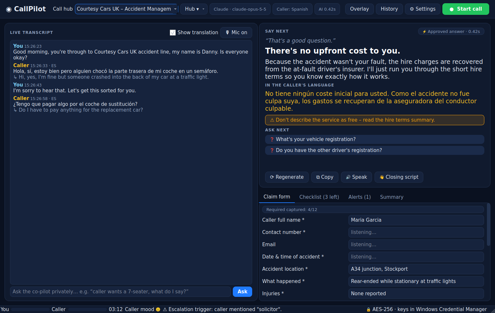

# CallPilot

CallPilot is a Windows desktop app for live calls. It listens to your microphone and to the audio of the app you choose (WhatsApp, Teams, Zoom, a softphone or a browser). It then:

- transcribes both sides of the call as people speak
- translates the call both ways
- gives you the next thing to say, using Claude or ChatGPT and trained on your company's call hub

The app is built for speed. You get something to say straight away, and the full answer is written while you are already talking.



## What happens when the caller stops talking

| Time | What you see |
|---|---|
| **0 ms** | A **filler line** chosen from the caller's tone, e.g. *"I'm sorry to hear that, let's get this sorted for you."* You start talking at once, so there is no dead air. |
| **< 5 ms** | An **⚡ approved answer**, if the question matches your hub's Q&A bank. This runs on your PC and does not wait for the AI. |
| **~0.5 s** | **SAY**: the key sentence of the AI answer, shown word by word. |
| while you speak | **MORE**: the rest of the answer, written while you are reading SAY. |
| end | **ASK NEXT**: questions that collect missing details. **WARN**: compliance reminders. **THEIR**: the reply in the caller's language. |

**Speculative drafting:** CallPilot starts writing the answer while the caller is still finishing their sentence. If their last words don't change the meaning, the draft is used as it is, which saves a full AI round-trip.

## Features

**Audio and speech**
- **Per-app capture.** CallPilot records only the selected app's audio, using Windows' process loopback. Music and notification sounds are ignored. You can also capture all computer audio.
- **Your microphone** is transcribed on a separate channel, so the transcript shows who said what.
- **Speech engines:**
  - Deepgram Nova-3 streaming. About 300 ms latency, word-by-word, follows a caller who switches language mid-call.
  - OpenAI `gpt-4o-transcribe`.
  - Offline faster-whisper. Nothing leaves your PC.
- **Echo guard.** If you use speakers and the caller's voice leaks into your mic, it is not credited to you.

**Translation**
- Translates the caller into your language, and your suggested replies into theirs.
- Uses the AI model by default (better with slang and context), or DeepL.
- **Voice interpreter (🔊 Speak).** Reads the translated reply aloud through any output device. Send it to a VB-Audio virtual cable and the caller hears it inside the WhatsApp call.

**Call hubs** (one per company or campaign)
- Each hub holds:
  - company name, persona and tone
  - opening, closing and consent scripts
  - rules, banned phrases, mandatory disclosures and escalation keywords
  - house filler phrases
  - a Q&A bank
  - a knowledge base: paste text or import PDF, Word, TXT, MD or CSV
- **✨ Generate Q&A with AI.** Turns your documents into an answer bank. Review every answer before saving.
- Hubs can be imported, exported, duplicated and shared as `.json`.
- **Courtesy Cars UK – Accident Management** comes pre-loaded. It covers non-fault claims, courtesy cars, recovery, repairs, write-offs, injury referral and police reporting.

**During the call**
- **Claim form fills itself.** Name, accident date and location, what happened, registrations, insurers, injuries and more. You can correct any field.
- **Compliance monitor:**
  - alerts you if *you* say a banned phrase (e.g. "it's free", "guaranteed")
  - ticks off mandatory disclosures as you make them
  - flags escalation words from the caller ("solicitor", "complaint", "hospital")
  - shows a caller mood meter
- **Ask the co-pilot privately**, e.g. *"caller wants a 7-seater, what do I say?"* This also works when you are not on a call, for practice.
- **Floating teleprompter overlay.** Always on top, translucent, draggable, can be made click-through, and hidden from screen-shares.
- **Global hotkeys** that work while WhatsApp has focus:

  | Keys | Action |
  |---|---|
  | `Ctrl+Shift+L` | Start / end call |
  | `Ctrl+Shift+Space` | Regenerate |
  | `Ctrl+Shift+O` | Show / hide overlay |
  | `Ctrl+Shift+C` | Copy suggestion |

**After the call**
- AI summary, outcome, next actions, liability view, vulnerability notes, compliance gaps, a 0–100 quality score and a coaching tip.
- Encrypted call history. Export to TXT, SRT subtitles or JSON. Delete securely.

## Security

| Area | How it works |
|---|---|
| Call history at rest | **AES-256-GCM** (authenticated encryption). Tampered files are rejected. |
| Data key | A random 256-bit key, protected by **Windows DPAPI** and bound to your Windows account. |
| App lock (optional) | Master passphrase. The key is wrapped with **scrypt** (N=2¹⁵), and the passphrase is needed every time CallPilot starts. |
| API keys | Stored in **Windows Credential Manager**. Never in settings files or logs. |
| Payment data | Card numbers (Luhn-checked), CVV, sort codes and account numbers are stripped before anything is sent to an AI provider. |
| Personal data | Phone, email, NI number, date of birth and postcode are redacted from saved history and log files. |
| Audit log | **Tamper-evident**: HMAC-SHA256 hash chain. *Settings → Privacy → Verify* detects any edited, deleted or re-ordered entry. |
| Retention | Calls are deleted automatically after N days (default 30), and overwritten before deletion. |
| Screen-share privacy | CallPilot windows are hidden from screen sharing, screenshots and recordings (`WDA_EXCLUDEFROMCAPTURE`). |
| Telemetry | None. Audio and text only go to the providers you configure. Choose the offline speech engine to keep audio on the PC. |

> **About "military grade":** AES-256-GCM is the cipher approved in the NSA's CNSA suite. However, CallPilot has **not** been formally certified (FIPS 140-3 / Common Criteria). Certification would need a validated crypto module and an independent assessment.

## Getting started

### 1. Install

Download `CallPilot-Setup.exe` (installer) or `CallPilot.exe` (portable). You can get them from:
- **GitHub → Actions → "Build CallPilot (Windows EXE)" → latest run → Artifacts**, or
- a GitHub Release (created when a `callpilot-v*` tag is pushed).

The EXE is not code-signed. Windows SmartScreen may say *"Windows protected your PC"*. Click **More info → Run anyway**, or sign the EXE with your company's certificate.

**Requirements:** Windows 10 version 2004 or newer, or Windows 11. Per-app capture needs 2004+.

### 2. Add API keys

Open **Settings → API keys** and add:

| Key | Needed for | Where to get it |
|---|---|---|
| **Anthropic** | Claude suggestions and translation | console.anthropic.com |
| **OpenAI** | ChatGPT, OpenAI transcription, voice interpreter | platform.openai.com |
| **Deepgram** | Fastest live transcription (recommended) | console.deepgram.com |
| DeepL (optional) | DeepL translation | deepl.com/pro-api |

You need at least one AI key (Anthropic or OpenAI) and one speech option (Deepgram, OpenAI, or offline).

### 3. Pick the call app

**Settings → Audio sources → Selected apps only**:
1. Start your WhatsApp call.
2. Click **Refresh running apps**.
3. Tick the app marked 🔊.

Use a **headset** for the cleanest result.

### 4. Choose a hub and press **● Start call**

Before you start, edit the hub (**Hub ▾ → Edit / train this hub…**) so its answers match your company's real policies.

## Speed tuning

| Setting | Where | Effect |
|---|---|---|
| Deepgram engine | Settings → Speech | About 300 ms transcripts with interim words. The biggest single speed gain. |
| End-of-turn silence (350 ms default) | Settings → Speech | Lower means suggestions start sooner. Too low cuts callers off mid-thought. |
| Claude effort = `low` (default) | Settings → AI | Fastest Claude Opus 5.5 answers. Opus 5.5 always does a little reasoning first. |
| Model `claude-haiku-4-5` or `claude-sonnet-5-5` | Settings → AI | Even lower first-token latency. |
| Fast mode | Settings → AI | Opus only, up to 2.5× faster output, premium pricing. |
| Speculative drafting (on by default) | Settings → AI | Answers before the caller has fully finished. |

The hub prompt uses **prompt caching**. Only the first request of a call pays for the full knowledge base, so later turns are faster and cheaper.

Claude requests turn on Anthropic's **server-side fallback** (`fallbacks: "default"`). If the main model declines a request, another model answers it in the same call. You can switch this off in Settings → AI.

## Legal

- **Tell callers they are being recorded and transcribed.** The consent reminder and checklist help with this. UK GDPR, PECR and FCA rules apply to recorded calls.
- AI suggestions are prompts for a trained human agent. They are not legal advice.
- The built-in Courtesy Cars hub is a **template**. Have it reviewed by your compliance team before live use.

## Building from source

On Windows (Python 3.11 or 3.12):

```bat
build.bat          :: venv + deps + tests + dist\CallPilot.exe (+ installer if Inno Setup is installed)
run.bat            :: run from source
```

On any OS (development):

```bash
pip install -r requirements-dev.txt
python -m pytest -q
python -m callpilot
```

To add offline speech: `pip install -r requirements-offline.txt`, then rebuild.

### Project layout

```
callpilot/
  ai/        copilot.py (live pipeline) · providers.py (Claude/ChatGPT) · translator.py · compliance.py
             streamparse.py (progressive SAY/MORE/ASK parser) · tts.py (voice interpreter)
  audio/     process_loopback.py (per-app WASAPI capture) · capture.py (mic/system/apps → 16 kHz channels)
             apps.py (app discovery) · dsp.py (resample, VAD)
  stt/       engines.py (Deepgram streaming, OpenAI, faster-whisper)
  hubs/      model.py + builtin/courtesy-cars-accident-management.json
  kb/        retriever.py (on-device BM25 search + instant Q&A matcher)
  core/      controller.py · crypto.py · audit.py · redact.py · secrets.py · sessions.py · config.py
  ui/        main_window.py · overlay.py · settings_dialog.py · hub_editor.py · history.py · widgets.py
packaging/   CallPilot.spec (PyInstaller) · CallPilot.iss (Inno Setup) · version_info.txt · make_icon.py
tests/       unit tests (core, co-pilot pipeline, providers, speech)
```

## Troubleshooting

| Symptom | Fix |
|---|---|
| "None of the selected apps are running or capturable" | Start the call first, then **Refresh running apps** and tick the 🔊 entry. Newer WhatsApp builds may run as `WhatsApp.Root.exe` or through `msedgewebview2.exe`. Tick whichever shows 🔊. |
| Caller's words appear as "You" | Use a headset, or keep the echo guard on (automatic). |
| No suggestions | Settings → API keys → **Test AI connection**. |
| Transcript stops | The status bar shows reconnect messages. Check your network or firewall allows `api.deepgram.com` (WebSocket). |
| Logs | `%APPDATA%\CallPilot\logs\callpilot.log` (personal data is redacted). |
