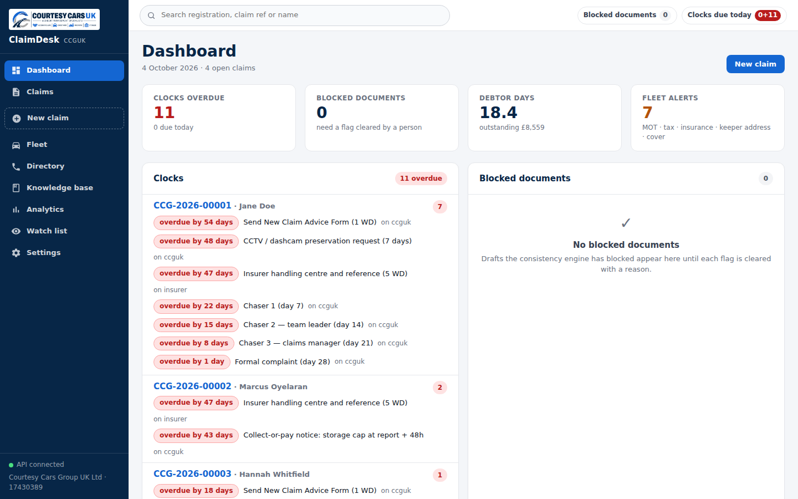
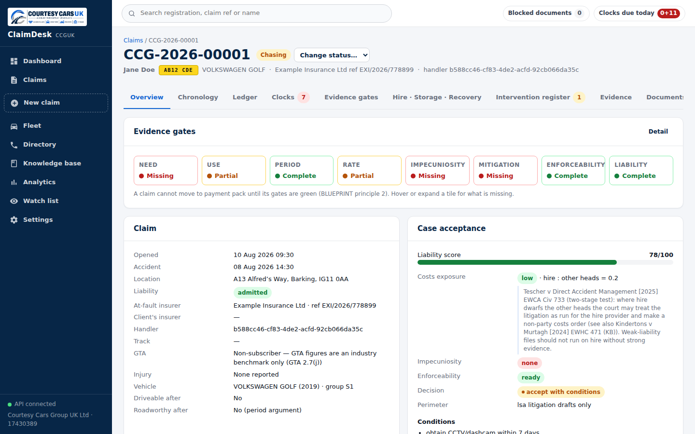
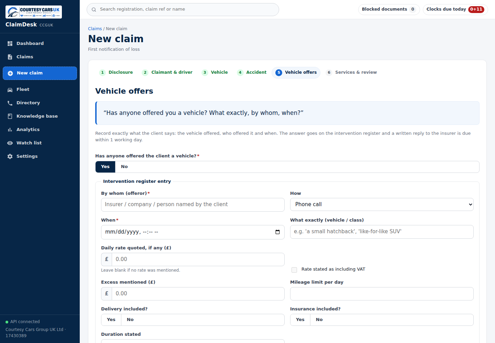
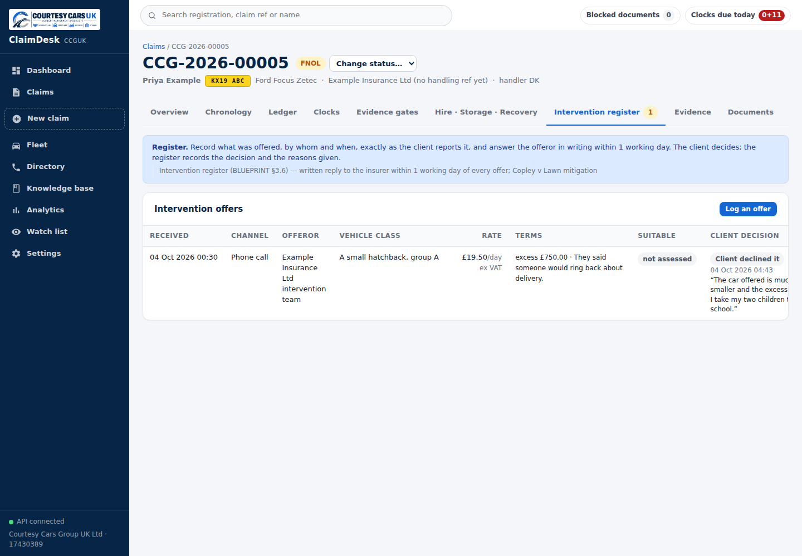
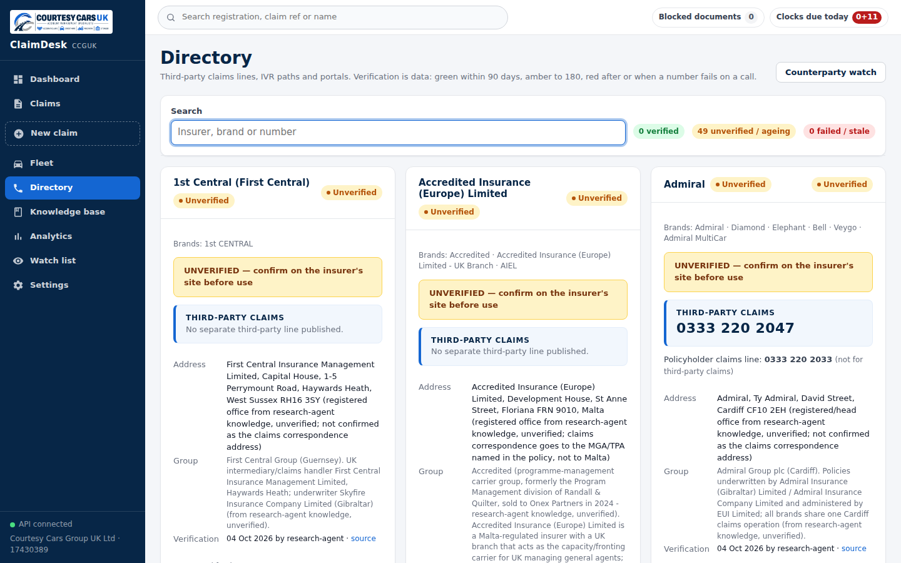
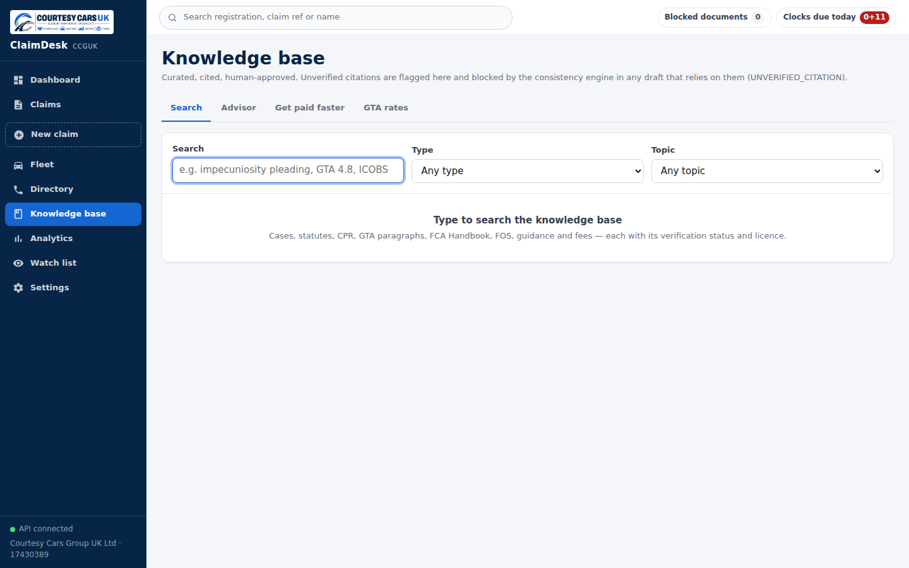
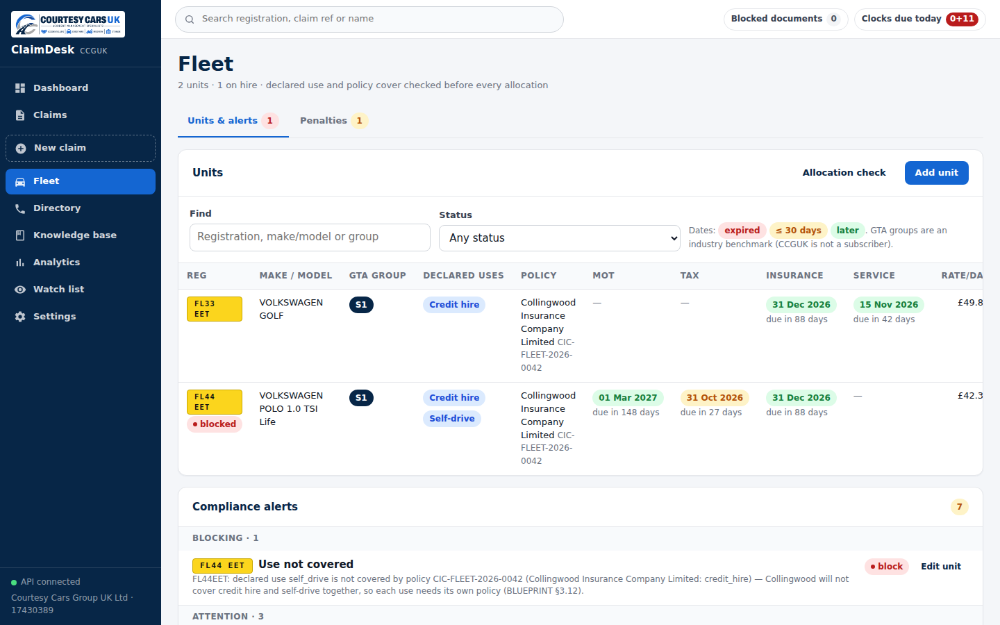
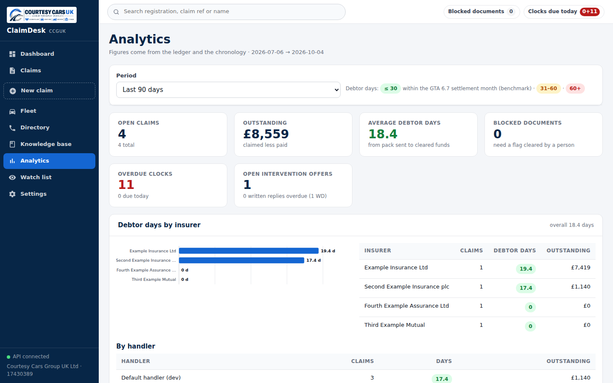

# ClaimDesk

ClaimDesk is the claims system for Courtesy Cars Group UK Ltd. It runs a claim from the first call to the final payment: hire, recovery, storage, engineering, valuation, letters, invoices, payment packs and litigation drafts. Every figure and date lives once, in the claim's ledger and chronology, and every document is built from that record and checked against it before it can be approved.

It is built for a two-to-four person team and runs in a browser, including on a phone.



## Start it

You need Node 22 and pnpm 10.

```bash
cd claimdesk
pnpm install
pnpm seed        # creates a database with four example claims, a fleet and a watch list
pnpm dev         # starts the API on 127.0.0.1:4000 and the app on http://localhost:5173
```

Open http://localhost:5173 and sign in. The sign-in screen fills in the default account for you:

- Username: `courtesycars`
- Password: `CourtesyCars123!`

Press **Sign in**. You stay signed in for 12 hours, and **Sign out** is in the top bar (in the menu on a phone).

> **Change this password in Settings before real data goes in; the repository is public.** Anyone who reads this README knows the default password, and the sign-in screen offers it to anyone who can open the app until you change it. Go to **Settings → Change password**. After that the screen fills in only the username. Set `LOGIN_PREFILL=false` to stop that too.

Copy `.env.example` to `.env` to add API keys and settings (see below).

To produce every document type as a sample PDF:

```bash
pnpm pdf:samples     # writes packages/documents/out/<template>.pdf
```

## What it does

| Area | What you get |
|---|---|
| **New claim** | A guided first-call form. It opens with the call-recording disclosure, takes the client's account in their own words, asks "Has anyone offered you a vehicle? What, by whom, when?" and logs the answer, and refers any injury to a solicitor with no fee. |
| **Vehicle look-up** | Enter a registration. With free DVLA and DVSA keys it pulls tax, MOT, mileage history and specification. Without keys it gives a manual form and marks the record unverified until a document backs it. It flags mileage that goes backwards or disagrees between documents, and a registration that is already on another file or is one of your own fleet cars. |
| **Clocks** | Every deadline on the file is calculated from the chronology: New Claim Advice Form in 1 working day, offer replies in 1 working day, off-hire triggers, storage after the engineer's report, the one-month settlement benchmark, ICOBS three months, chasers on days 7, 14 and 21, complaint at day 28, DISP eight weeks, DSAR one month, NIP 14 days, s.172 28 days, limitation. Each shows its legal basis. |
| **Evidence gates** | Need, use, period, rate, impecuniosity, mitigation, enforceability and liability each show green, amber or red, and list exactly what is missing. A claim cannot reach payment pack with a red gate. |
| **Intervention register** | Every courtesy-car offer is logged with who, when, what, the rate and terms, and the client's decision in their words. A written reply is drafted the same day. |
| **Next actions** | The get-paid-faster playbook: what to do now, why, the rule behind it, what it is worth, and the letter to send. |
| **Documents** | 37 branded templates (listed below). Each is drafted from the claim, checked, approved by a person, then sent by you. Nothing is ever sent automatically. |
| **Consistency check** | Before approval, every draft is read and compared with the ledger, the offer register, the hire and storage records and earlier letters. See the next section. |
| **E-signature** | Hire agreements and forms are signed by one-time code, with the signer, time, IP address and document fingerprint on a completion certificate. |
| **Evidence store** | Photos and documents are fingerprinted (SHA-256) on upload, their camera time and location read, and stored write-once. A guided phone camera flow takes the 8–12 standard shots. |
| **Engineering** | Estimate editor with labour, parts, paint, materials, ADAS and pre-existing damage kept separate; import of estimate text from Audatex or bodyshop PDFs; an in-house labour-time library built from your own approved estimates; engineer's report with every required section and CPR 35 wording when it is for court. |
| **Valuation** | Pre-accident value from manually captured adverts: filters like-for-like, adjusts for mileage from the adverts' own price curve, removes outliers, Cat S/N and ex-fleet cars, and gives the median with a range and a written explanation the engineer approves. |
| **Total loss** | Repair route (repair, hire and storage) against total-loss route (value less salvage, using real bids), and an early total-loss score at first notice. |
| **Fleet** | MOT, tax, insurance and service alerts; blocks putting a car on hire for a use its policy does not cover; flags a stale keeper address; PCN and NIP workflow with the liability-transfer notice and s.172 reply. |
| **Directory** | Insurer third-party lines, menu options, emails and portals, each with a verification age (green, amber at 90 days, red at 180 or after a failed call) and known lookalike numbers. |
| **Knowledge base** | Cases, statutes, CPR, GTA paragraphs, FCA rules, FOS approach and guidance, searchable, with an advisor that gives cited points per topic and warns when a forum is not open. |
| **Watch list** | Companies House monitoring of suppliers and counterparties. CARFLEX LTD (12640635) is on it as high risk. |
| **Analytics** | Debtor days by insurer, reductions by head, cycle times and intervention outcomes. |

### The consistency check, with the File 1 example

On a live file a letter told the insurer £1,287 had been received when the ledger showed £1,112. ClaimDesk blocks that letter: it reads every amount, date and assertion in the draft and compares it with the ledger. The draft cannot be approved until a person either corrects it or clears the flag with a written reason, and that reason is kept. It also blocks legacy details (Car Flex, 17360033, 66 Paul Street, EC2A 4PX, courtesycarsuk.co.uk), wording that implies you are solicitors, any threat of the Financial Ombudsman to an at-fault insurer, GTA terms stated as legal entitlement, "no vehicle was offered" when the register shows an offer, and a payee that is not exactly "Courtesy Cars Group UK Ltd".



### Documents

| Kind | Templates |
|---|---|
| Letters to the insurer | New Claim Advice Form, handling reference request, intervention-offer reply, collect-or-pay storage notice, repair delay notice, chasers at days 7, 14 and 21, DISP complaint, DSAR, total-loss valuation challenge, particularisation demand, vendor verification pack |
| Litigation drafts (for the claimant or a solicitor to sign) | Letter before claim, Part 36 offer, witness statement, litigation bundle index, schedule of loss |
| Invoices | Hire, storage, recovery, engineer's fee |
| Reports | Engineer's report, pre-accident value report |
| Client documents | Credit hire agreement, cancellation form, request to start during the cancellation period, mitigation questionnaire, statement of means, statement of need, client update |
| Packs and notices | GTA-style payment pack, PCN liability transfer, s.172 reply, CCTV preservation request, engineer instruction, e-signature certificate |

## Keys and settings

Everything works without keys. Free keys switch on live look-ups; see `docs/SETUP-APIS.md` for where to register and what each costs.

| Setting | Why |
|---|---|
| Registered office, bank name, VAT and ICO numbers (Settings screen) | Printed in every document footer and on invoices |
| `DVLA_VES_API_KEY` | Free vehicle details |
| `DVSA_MOT_*` | Free MOT and mileage history |
| `COMPANIES_HOUSE_API_KEY` | Free supplier monitoring |
| `ESIGN_SECRET` | Required for e-signature in production |
| `DEFAULT_LOGIN_USERNAME`, `DEFAULT_LOGIN_PASSWORD` | The account created on first start (default `courtesycars` / `CourtesyCars123!`). Only used when no user has that username yet |
| `LOGIN_PREFILL` | `true` by default: the sign-in screen fills in the default account until its password is changed. Set `false` to fill in nothing |

## What to do first

1. **Verify the knowledge base.** This build had no internet access, so nothing in it is marked verified, and every citation shows an amber badge. `docs/RESEARCH-CORRECTIONS.md` lists 19 places where research contradicted the original brief. The most important: Irani v Duchon is not a credit hire case, CPR interim payments moved to rules 25.20–25.26, and ICOBS 8.2 appears to cover domestic third-party claims.
2. **Check each insurer's third-party line** on the insurer's own site and press "Mark verified today" in the Directory.
3. **Fill in Settings** so documents stop printing "[registered office]".
4. **Change the default password** (Settings → Change password) before real data goes in, and add MFA before anyone but you can reach the system (`docs/KNOWN-ISSUES.md`).

## Legal boundaries built in

ClaimDesk prepares documents; a person approves and sends each one. Litigation documents are drafts for the claimant as a litigant in person, or for an instructed solicitor, because conducting litigation is a reserved activity. Injury elements are referred out with no fee. The GTA is quoted as an industry benchmark, because CCGUK is not a subscriber. Comparable adverts are captured by hand, never scraped. Details are in `docs/LEGAL-CAVEATS.md`.

## How it is built

| Folder | What it is |
|---|---|
| `packages/domain` | The rules: clocks, GTA, consistency check, valuation, estimating, total loss, quantum, acceptance, playbook, intake, fleet. No database or network. |
| `packages/kb` | The knowledge base and insurer directory, with search and the advisor |
| `packages/documents` | The 37 templates and the PDF renderer |
| `packages/db` | Database schema; the ledger, chronology, evidence and audit log cannot be edited or deleted |
| `apps/api` | The server that joins it all together |
| `apps/web` | The app |
| `docs/` | `BLUEPRINT.md` (the specification), `ARCHITECTURE.md`, `RESEARCH-CORRECTIONS.md`, `LEGAL-CAVEATS.md`, `SETUP-APIS.md`, `KNOWN-ISSUES.md` |

```bash
pnpm test          # all packages
pnpm typecheck
```

### Screens

| | |
|---|---|
|  |  |
|  |  |
|  |  |
